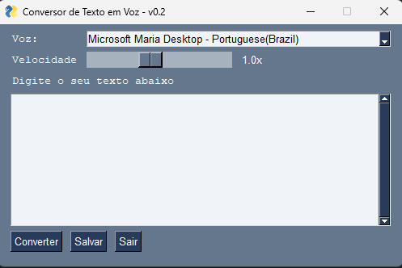

# Conversor de Texto em Voz

Este projeto foi desenvolvindo com fins de estudo da aplicação de conversão de texto em áudio. Sendo assim construiída uma interface gráfica simplificada para realizar a interação com o usuário para entrada do texto e controles básicos na geração do áudio gerado.

 

 

## Tecnologias utilizadas
- [Python 3.x](https://www.python.org/)
- [PySimpleGUI](https://www.pysimplegui.org/en/latest/cookbook/) (geração de interface gráfica)
- pyttsx3 (conversão do texto em áudio)

## Preparação do Ambiente

~~~bash
# Criação do ambiente virtual
$ virtualenv .venv

# Ativação do ambiente virtual
$ .venv\Scripts\activate.bat

# Instalação dos pacotes de dependência
$ pip install -r requirements.txt
~~~

## Execução do aplicativo
~~~bash
$ (.venv) app.py
~~~

## Criação de arquivo .exe

Caso deseje realizar a conversão desde script python para um arquivo executável, realize a seguinte sequência de tarefas:

- __Passo 1:__ Abra a interface do `auto-py-to-exe`. Execute o seguinte comando em seu terminal.

~~~bash
$ auto-py-to-exe
~~~

- __Passo 2:__ Selecione o local em seu computador onde se encontra o arquivo `app.py`.
- __Passo 3:__ Em *Arquivo Único (One File)*, selecione a opção `Um arquivo (One File)`.
- __Passo 4:__ Clique em `Converter .py para .exe (Convert .py to .exe)` e aguarde o térmido do processo de compilação.

Em caso de dúvidas, verifique maiores infomações sobre o `auto-py-to-exe` [clicando aqui](https://pypi.org/project/auto-py-to-exe/).

---

Autor: <a href="https://github.com/gabriel-laurindo-1"> Gabriel Laurindo &#169; 2023 </a> 
